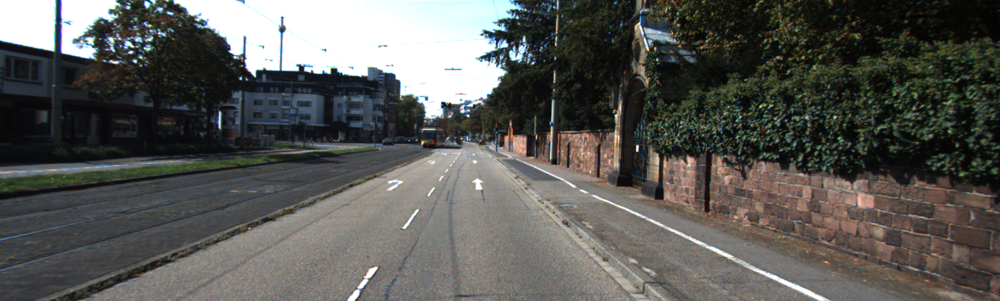
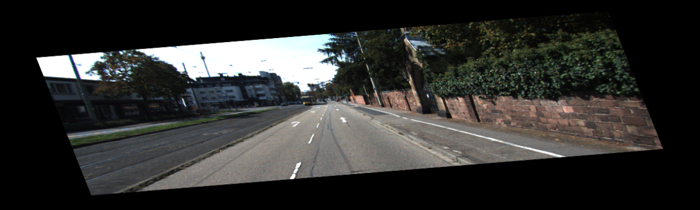
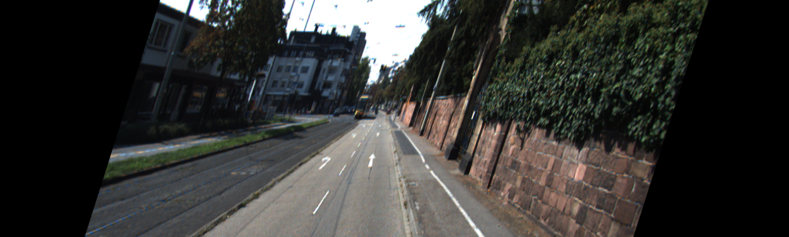
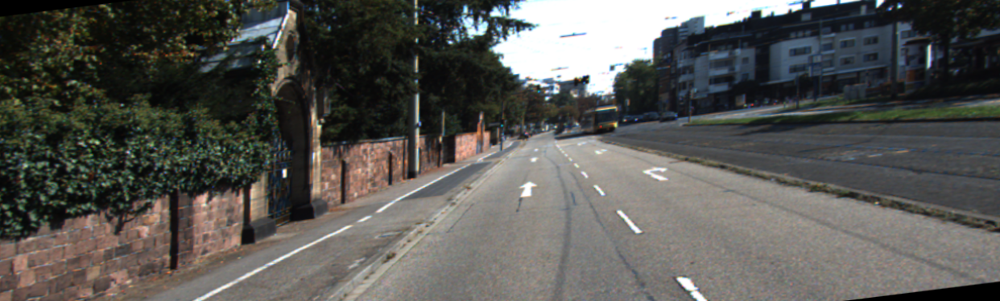

# Semantic Segmentation

## Model validataion

First of all I've splitted training dataset in two parst - train and validate. I've randomly chosed 30 images and hardcoded them as validation and helpers.py.

## Augmentation
For augmentation I used [imgaug](https://github.com/aleju/imgaug) library and added random rotation/shear/scale/crop/flipr to images, see in Main.py:

```python
seq = iaa.Sequential([
            iaa.Affine(rotate=(-10, 10),  scale={"x": (1/1.6, 1.6), "y": (1/1.6, 1.6)},shear=(-20, 20)), #randomly rorate by 10px
            iaa.Crop(px=(0, 10)), # crop images from each side by 0 to 16px (randomly chosen)
            iaa.Fliplr(0.5), # horizontally flip 50% of the images
        ])
```

Some examples, original image:

And five augmentated iamges:





## Parametrs selection

Finally on validation dataset I've calculated loss and iou for parametrs: learning rage 0.01 and 0.001, dropupt 0.5, 0.3 and 0.7 and using/not using augmentation. The result was:

Learning rage  | Dropout 03 | Dropout 05 | Dropout 07
------------- | ------------- | ------------- | ------------- |
0.0010, | 0.640 | 0.601 | 0.677
0.0100, | 0.404 | 0.366 | nan

### Setup
##### Frameworks and Packages
Make sure you have the following is installed:
 - [Python 3](https://www.python.org/)
 - [TensorFlow](https://www.tensorflow.org/)
 - [NumPy](http://www.numpy.org/)
 - [SciPy](https://www.scipy.org/)
##### Dataset
Download the [Kitti Road dataset](http://www.cvlibs.net/datasets/kitti/eval_road.php) from [here](http://www.cvlibs.net/download.php?file=data_road.zip).  Extract the dataset in the `data` folder.  This will create the folder `data_road` with all the training a test images.

### Start
##### Implement
Implement the code in the `main.py` module indicated by the "TODO" comments.
The comments indicated with "OPTIONAL" tag are not required to complete.
##### Run
Run the following command to run the project:
```
python main.py
```
**Note** If running this in Jupyter Notebook system messages, such as those regarding test status, may appear in the terminal rather than the notebook.

### Submission
1. Ensure you've passed all the unit tests.
2. Ensure you pass all points on [the rubric](https://review.udacity.com/#!/rubrics/989/view).
3. Submit the following in a zip file.
 - `helper.py`
 - `main.py`
 - `project_tests.py`
 - Newest inference images from `runs` folder  (**all images from the most recent run**)
 
 ## How to write a README
A well written README file can enhance your project and portfolio.  Develop your abilities to create professional README files by completing [this free course](https://www.udacity.com/course/writing-readmes--ud777).
